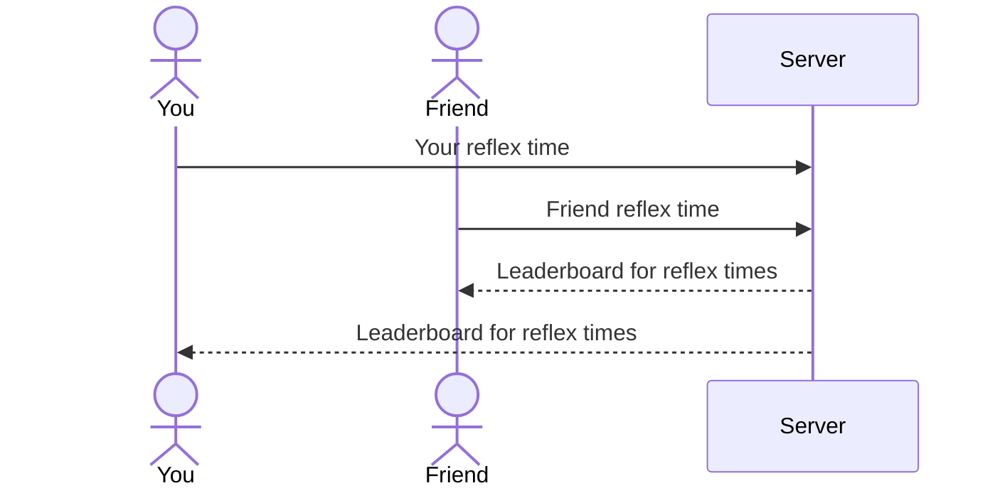

# Speed Cola Click Test

[My Notes](notes.md)

In the popular Call of Duty: Black Ops franchise, players can drink "Speed-Cola" to increase their speed. This application will test users' reaction times in a game where they must click the screen as soon as it changes colors. The user will repeat the game three times to get an average reaction time at which point they can add their score to the global leaderboard if signed in. If they are fast enough, they will be given a message saying they have the Speed Cola perk!

## 🚀 Specification Deliverable

For this deliverable I did the following. I checked the box `[x]` and added a description for things I completed.

- [x] Proper use of Markdown
- [x] A concise and compelling elevator pitch
- [x] Description of key features
- [x] Description of how you will use each technology
- [x] One or more rough sketches of your application. Images must be embedded in this file using Markdown image references.

### Elevator pitch

Fuel your reflexes with the Speed Cola Click Test, the ultimate reaction-speed challenge! Inspired by the iconic perk from Call of Duty: Black Ops Zombies that speeds up the player, this website will put your reflexes to the test and measure your reaction time. In three attempts, you will click the screen when it changes color and you will be given an average reaction time and a place in the global leaderboard. If you are fast enough, you can prove that you have the Speed Cola perk in real life!

### Design

Here is a diagram for how the backend will store scores and display them to the user.

### Key features

- Tracks exact reflex time down to milliseconds
- Leaderboard scores and personal bests are persistently stored
- Secure login system
- Real-time notifications to all users when someone places on the leaderboard

### Technologies

I am going to use the required technologies in the following ways.

- **HTML** - Uses correct HTML structure for web application. Four HTML pages, one for login, one to play, one about page, and one to view the leaderboard.
- **CSS** - Website styling that maintains functionality across different screen sizes and devices. Uses good spacing, color choices that resemble the theme of Speed Cola and good contrast.
- **React** - React handles the login, calculating average reaction times, displaying the leaderboard, routing, and components.
- **Service** - Backend service with endpoints for:
  - login
  - retrieving scores
  - submitting scores
  - Third-party API for logging what city a user is playing from (using IP address), which will be logged with their high score and broadcasted when they place on the leaderboard.
- **DB/Login** - Store users, personal bests, and leaderboard scores in database. Register and login users. Credentials securely stored in database. Can't place on leaderboard unless authenticated.
- **WebSocket** - As any user places on the leaderboard, their name is broadcast to other players.

## 🚀 AWS deliverable

For this deliverable I did the following. I checked the box `[x]` and added a description for things I completed.

- [x] **Server deployed and accessible with custom domain name** - [jakenef.click](https://jakenef.click).

## 🚀 HTML deliverable

For this deliverable I did the following. I checked the box `[x]` and added a description for things I completed.

- [x] **HTML pages** - Four html pages that represent login, playing the game, seeing the leaderboard, and an about section.
- [x] **Proper HTML element usage** - I used the correct <aside> tag for a section in the play.html file and I used headers and footers appropriately.
- [x] **Links** - In the header there are in-app links and in the footer there is a link to my github.
- [x] **Text** - I used different h tags and p tags to describe what was happening on the play and leaderboard pages. I also used bold and italics in both.
- [x] **3rd party API placeholder** - On the leaderboard page, one of the columns will show what city a high score was achieved from.
- [x] **Images** - I updated the site icon and added an image to the about page.
- [x] **Login placeholder** - I used form tags correctly to format the login page structure.
- [x] **DB data placeholder** - The leaderboard information will be stored in the database as well as personal bests.
- [x] **WebSocket placeholder** - In the aside in the play.html file, there will be notifications pushed from the server when a player finishes a game and gets a time.

## 🚀 CSS deliverable

For this deliverable I did the following. I checked the box `[x]` and added a description for things I completed.

- [x] **Header, footer, and main content body** - I implemented Bootstrap header that is fully functional.
- [x] **Navigation elements** - I changed the nav to be a bootstrap element and made it so that the active link is lighter.
- [x] **Responsive to window resizing** - I used lots of flex boxes and percentages rather than fixed values to make my app responsive.
- [x] **Application elements** - I used good contrast and kept with the Speed-Cola green theme throughout.
- [x] **Application text content** - I have a custom font for the whole site that looks good. Purposefully changed the score font.
- [x] **Application images** - I have my speed-cola icon placed in some good CSS.

## 🚀 React part 1: Routing deliverable

For this deliverable I did the following. I checked the box `[x]` and added a description for things I completed.

- [x] **Bundled using Vite** - I bundled and debugged using Vite and npm run dev.
- [x] **Components** - I set up login, about, play, and leaderboard. The navigation works. Everything works as it did in the old version without React.
- [x] **Router** - I set up BrowserRouter and used the Navlinks to route and make my application an SPA.

## 🚀 React part 2: Reactivity

For this deliverable I did the following. I checked the box `[x]` and added a description for things I completed.

- [x] **All functionality implemented or mocked out** - The game is playable and leaderboard updates with scores. Stubbed out 
the websocket game notifications in toast messages on Play and api call in the locations on the leaderboard.
- [x] **Hooks** - Used useState and useEffect in speedGame and elsewhere.

## 🚀 Service deliverable

For this deliverable I did the following. I checked the box `[x]` and added a description for things I completed.

- [ ] **Node.js/Express HTTP service** - I did not complete this part of the deliverable.
- [ ] **Static middleware for frontend** - I did not complete this part of the deliverable.
- [ ] **Calls to third party endpoints** - I did not complete this part of the deliverable.
- [ ] **Backend service endpoints** - I did not complete this part of the deliverable.
- [ ] **Frontend calls service endpoints** - I did not complete this part of the deliverable.

## 🚀 DB/Login deliverable

For this deliverable I did the following. I checked the box `[x]` and added a description for things I completed.

- [ ] **User registration** - I did not complete this part of the deliverable.
- [ ] **User login and logout** - I did not complete this part of the deliverable.
- [ ] **Stores data in MongoDB** - I did not complete this part of the deliverable.
- [ ] **Stores credentials in MongoDB** - I did not complete this part of the deliverable.
- [ ] **Restricts functionality based on authentication** - I did not complete this part of the deliverable.

## 🚀 WebSocket deliverable

For this deliverable I did the following. I checked the box `[x]` and added a description for things I completed.

- [ ] **Backend listens for WebSocket connection** - I did not complete this part of the deliverable.
- [ ] **Frontend makes WebSocket connection** - I did not complete this part of the deliverable.
- [ ] **Data sent over WebSocket connection** - I did not complete this part of the deliverable.
- [ ] **WebSocket data displayed** - I did not complete this part of the deliverable.
- [ ] **Application is fully functional** - I did not complete this part of the deliverable.
